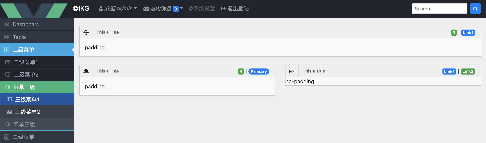
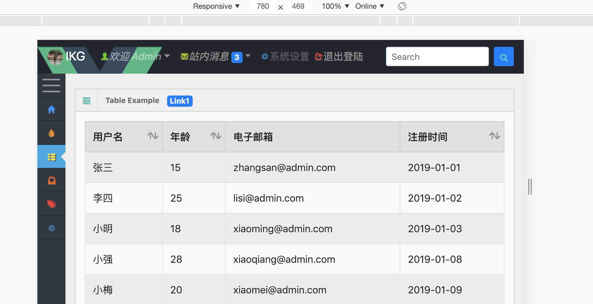
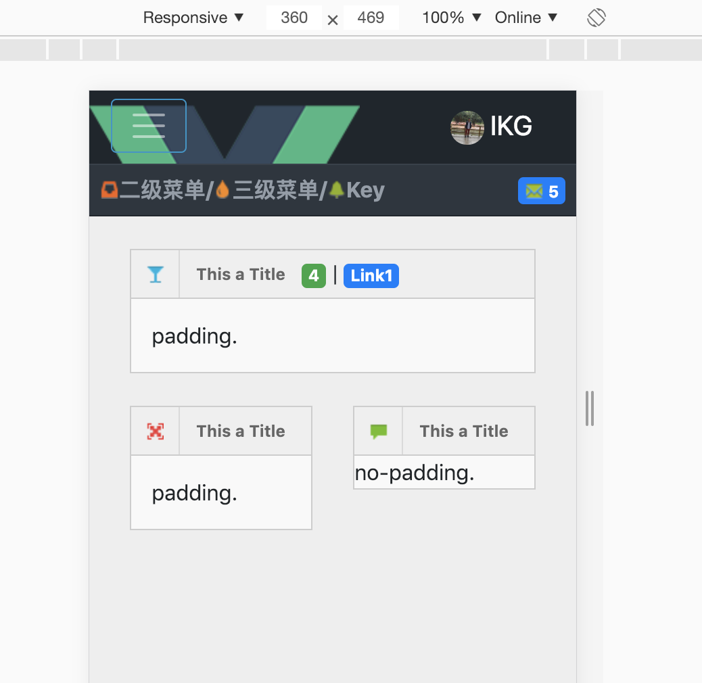
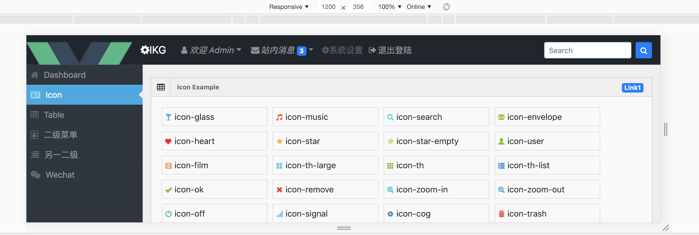

# bootstrap-vue-admin

bootstrap-vue-admin : admin management system template based on vue + bootstrap-vue + vue-router + jquery

## install && run

```base

git clone https://github.com/ikaiguang/bootstrap-vue-admin.git

cd bootstrap-vue-admin

npm install

# vue cli v3
npm run serve

```

## 开发环境

vue-cli version 3.2.3

```bash

# cli v3
sudo npm install -g @vue/cli

# cli v2
sudo npm install -g @vue/cli-init

```

## Documentation

- [vue-js](https://cn.vuejs.org/)
- [bootstrap-vue](https://bootstrap-vue.js.org/)

## live dome

https://ggguang.github.io

```text

Account  : ikaiguang@github.com
Password : password

```

## images

> login


> index



> index2


> response



> mobile-phone



> icon



## License

Released under the [MIT License](License)
